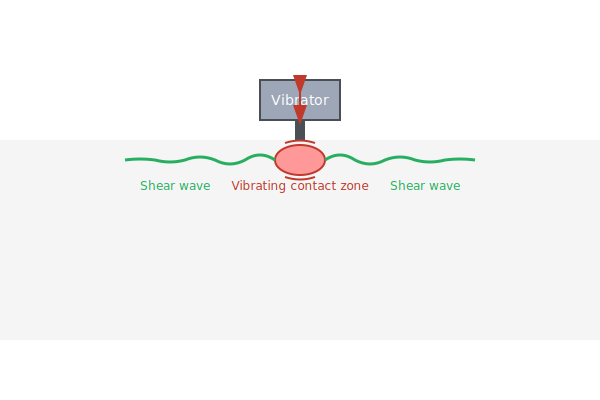
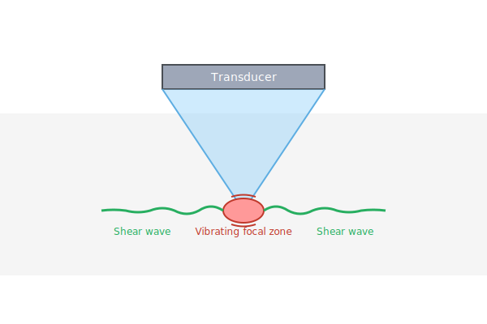

# 🌊 Ultrasonic Observation of Shear Waves

Shear waves play a crucial role in ultrasound elastography and tissue
characterization. Unlike compressional waves, shear waves propagate much slower
and are highly sensitive to tissue mechanical properties. 

## Introduction

Shear waves are transverse mechanical waves that propagate perpendicular to the
direction of particle motion. In biological tissues, shear wave velocity is
directly related to tissue stiffness, making them invaluable for medical
diagnostics.

### Key Properties

- **Velocity**: Typically 1-10 m/s in soft tissues (much slower than compressional waves at ~1540 m/s)
- **Frequency**: Usually 50-1000 Hz for elastography applications
- **Attenuation**: Higher than compressional waves, limiting penetration depth

## Generating Shear Waves

### Mechanical Vibration

One way to generate shear waves is through mechanical vibration: you can
literally shake the tissue to make the shear waves. This is actually done as
part of the proof-of-concept in a number of papers on shear wave elastography.
However, it clearly isn't practical for clinical use: you're not going to cut
open a patient and shake their liver to measure its stiffness!

### Acoustic Radiation Force

A more practical method for clinical use is to use the acoustic radiation force
to cause shear waves. The basic idea is to use a focused ultrasound beam to
cause local vibrations at a point in the tissue. This creates shear waves that
propagate away from the focal point, and can be observed.

In general, ultrasound shear wave elastography uses time-of-flight methods,
which assume a constant shear wave speed, to measure the shear wave velocity.
The shear wave speed is then related to tissue stiffness or viscoelastic
properties.

This site has a couple additional pages about aspects of how ultrasound can
create shear waves:

* [Ultrasound Focusing](/ultrasound-focusing/): This page contains an interactive tool to show how 
  ultrasound can be focused to a specific point in the tissue.
* [Harmonic Generation](): This page explains how the square-wave pulse
  sequence used in, for example, shear wave dispersion ultrasound vibrometry
  (SDUV) can create harmonics of a fundamental frequency, allowing a single ARF
  excitation to be used to sample shear wave speed at multiple frequencies.
